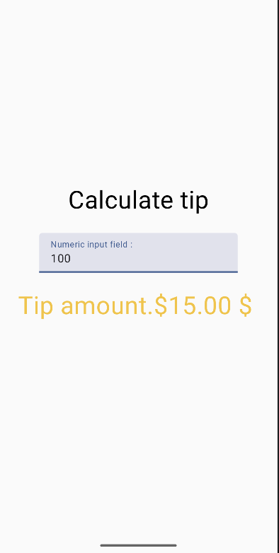

# Learning Android Development

So far: 
- Basics of Kotlin
- Basics of Android Development
- Basics of Jetpack compose
  - @Composable functions
  - Previewing Components / @Composable functions
  - Basic building blocks `Box`, `Row`, `Column` , `Text`
  - Using Images in Jetpack compose
  - Extracting application wide Strings as resources and into de res/values folder.
  - First "interactive" Composable (see DiceRoller.kt)
  - Starting up with `Modifiers` (argumentos para decorar y dar funcionalidad a componentes )
  - Added auto documentation. Generating in [Docs](docs/index.html)
  - Created `ComposablesReference.kt` which is aimed to have a summary of the most important @Composable functions readily available as reference (e.g., Text, Spacer, Surface, InputText, TextField)
  - Created `TipCalculator` a super simple application showcasing Composability and State use at different levels.

# Generating the documentation

`./gradlew dokkaHtml --no-build-cache --rerun-tasks`

# Showcase

